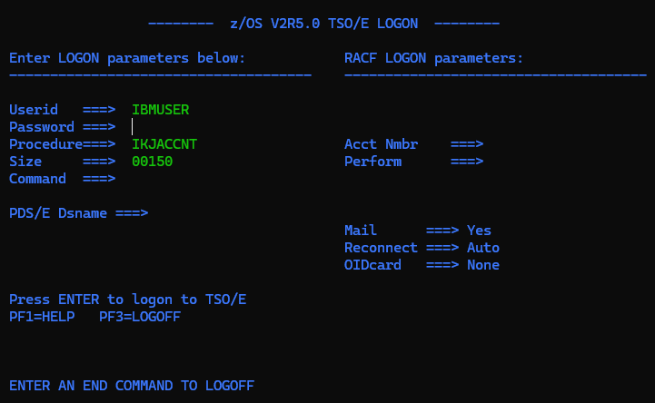
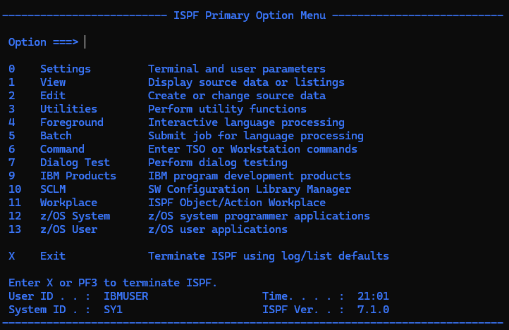

# 3270 TN3270 Server

A Python implementation of a TN3270 server that presents an authentic IBM mainframe experience — complete TSO/E logon panel, RACF authentication, and the ISPF Primary Option Menu — over a standard TCP connection. Connect any real 3270 emulator and it just works.

## What you can do

1. **Connect** any TN3270 emulator (wc3270, x3270, Vista TN3270, etc.) to `localhost:2323`
2. **Log in** using a RACF userid and password — the server validates credentials and shows proper error messages for bad passwords or missing userids
3. **Navigate** the ISPF Primary Option Menu — the keyboard is fully live; type an option number and press Enter

### Logon panel

The server presents an authentic z/OS V2R5.0 TSO/E LOGON screen. Fill in your userid and password and press Enter.



**Built-in credentials**

| Userid | Password |
|--------|----------|
| `IBMUSER` | `SYS1` |
| `TESTUSER` | `RACF` |

The server follows z/OS RACF conventions: userids and passwords are case-insensitive (uppercased before comparison). A wrong password returns `IKJ56425I PASSWORD NOT CORRECT FOR <userid>`. A missing userid returns `IKJ56700I USERID MUST BE SPECIFIED`.

### ISPF Primary Option Menu

After a successful login you land on the ISPF Primary Option Menu. The keyboard is unlocked — you can type option numbers and press Enter. Entering `X` or pressing PF3 logs you off and returns to the TSO/E logon panel. Pressing **PF1** on either panel shows a help screen (PF3 returns).



The full z/OS ISPF 7.1.0 menu is rendered, including the user ID, system ID (SY1), and current time in the status block. Options 0–13 and X are listed. Option `0` opens a Settings sub-panel (complete with an action bar across the top); PF3 returns. Option `1` (View) prompts for a panel-library member and browses its actual DTL source, paging with PF7/PF8; PF3 returns. Option `3` (Utilities) opens a nested Utility Selection sub-menu with its own Option line; its Library choice (`3.1`) lists the real panel-library members (`ISPF.ISPPLIB`) in a `<lstfld>` table, and PF3 steps back out one level at a time. Option `6` (Command) opens a TSO Command Shell: type a command and press Enter; `TIME` returns the live TSO time message and any other verb gets the authentic `IKJ56500I COMMAND xxx NOT FOUND`; PF3 returns. Option `7` (Dialog Test) opens a Variables sub-panel that lists the session's ISPF dialog variables (`ZUSER`, `ZTIME`, `ZDATE`, …) with their live values in a `<lstfld>` table; PF3 returns. The other options return to the menu with a short message.

## Quick start

### Prerequisites

- Python 3.8+
- A TN3270 emulator — [wc3270](https://x3270.miraheze.org/wiki/Wc3270) (Windows) or [x3270](https://x3270.miraheze.org/wiki/X3270) (Linux/macOS) are free and work out of the box

### Run the server

```sh
python server.py
```

The server listens on port 2323 by default (no root/administrator required, unlike port 23).

### Connect with wc3270 (Windows)

```sh
wc3270 localhost:2323
```

### Connect with x3270 (Linux / macOS)

```sh
x3270 localhost:2323
```

### Connect with any emulator

Point your emulator at `localhost`, port `2323`. The server negotiates TN3270E binary mode, EOR, and terminal-type options automatically and supports IBM-3278 model 2–5 terminals.

## How it works

### TN3270 protocol

TN3270 is Telnet extended with IBM 3270 data-stream framing. The server performs the full Telnet option negotiation (BINARY, EOR, TERMINAL-TYPE) before sending any screen data.

### 3270 data stream

Screens are built with authentic 3270 orders:

| Order | Hex | Purpose |
|-------|-----|---------|
| ERASE_WRITE | `0xF5` | Clear screen and write new data |
| SBA | `0x11` | Set Buffer Address — position the write cursor |
| SF | `0x1D` | Start Field — define a protected or unprotected input field |
| IC | `0x13` | Insert Cursor — place the cursor in an input field |

The Write Control Character (WCC) sent after ERASE_WRITE uses `0x43` — the correct x3270/wc3270 bit layout (`WCC_RESET_BIT | WCC_KEYBOARD_RESTORE_BIT | WCC_RESET_MDT_BIT`) — so the keyboard unlocks immediately after every screen update.

### Field parsing

When the user presses Enter or a PF key, the emulator sends an AID byte followed by the cursor address and the contents of all modified fields. The server decodes the 12-bit packed buffer addresses and reads each field's EBCDIC text, then strips whitespace and uppercases credential fields before comparing.

## Project structure

```
server.py       — TN3270 protocol: negotiation, session loop, the 3270 primitives
screen.py       — Screen/Field model: renders to a 3270 data stream, parses responses
screens.py      — the two panels built as Screen objects (the in-code reference)
dtl.py          — Dialog Tag Language parser: load_panel() → Screen, load_message_member() → MessageCatalog
panels/         — the screens authored declaratively
  logon.dtl       z/OS TSO/E LOGON panel
  ispf.dtl        ISPF Primary Option Menu
  tsohelp.dtl     PF1 help for the logon panel
  ispfhelp.dtl    PF1 help for the ISPF menu
  settings.dtl    ISPF Settings sub-panel (option 0; has an action bar)
messages/       — message members, kept apart from panels as on z/OS (ISPMLIB vs ISPPLIB)
  tsomsgs.dtl     TSO/E logon messages (IKJ56425I, IKJ56700I)
```

Screens are **data, not code**. `server.py` no longer hand-assembles bytes; `send_tso_logon`
and `send_ispf_menu` call `dtl.load_panel("logon" | "ispf")`, which parses the `.dtl` source
into a `Screen` that renders itself to the 3270 data stream.

Key functions:

| Function | What it does |
|----------|-------------|
| `tn3270_negotiate` | Performs Telnet option handshake |
| `dtl.load_panel` | Parses a `panels/*.dtl` source into a `Screen` |
| `screen.Screen.render` | Renders a `Screen` to a 3270 data stream |
| `screen.Screen.parse` | Maps a client response onto named fields |
| `read_client_input` | Reads and parses an AID response from the client |
| `encode_pack_addr` | Converts (row, col) to a 12-bit 3270 buffer address |
| `handle_client` | Main session loop: logon → ISPF → logoff |

### Declarative screens (DTL)

Panels are written in a pragmatic subset of IBM's **Dialog Tag Language** — the ISO-SGML
markup ISPF panels are defined in (compiled on z/OS via the `ISPDTLC` utility). A field looks
like:

```sgml
<dtafld row="5" col="1" fldcol="16" datavar="userid" entwidth="8" cursor="yes">Userid   ===></dtafld>
```

Supported tags: `<panel>`, `<info>` (text/instructions, with `fill`+`width` rules),
`<dtafld>` (prompt + input field), `<cmdarea>` (the ISPF "Option/Command ===>" line, bound to
`ZCMD`), `<selfld>`/`<choice>` (menu lists; each `<choice matchval>` registers a selectable
value the server validates against), `<keyl>`/`<keyi>` (a keylist binding function keys to
commands), `<cmdtbl>`/`<cmd>`/`<cmdact>` (an application command table — the command line
recognizes named commands, with truncation), `<varclass>`/`<varlist>`/`<vardcl>` (typed variable
declarations — a field inherits `numeric` from its class, and a class's `<checkl>`/`<checki>`
range/value checks validate the field's input, e.g. the logon SIZE field), `<ab>`/`<abc>`/`<pdc>`
(an action bar with pull-down choices — put the cursor on a choice and press Enter to open its
pull-down, point-and-shoot style; or use **F10/F11** to step the cursor left/right across the
choices), `<topinst>`/`<paninst>`
(instruction text), `<lstfld>`/`<lstcol>`/`<lstgrp>` (a scrollable list/table — the column
headings are laid out left-to-right by `colwidth`, with a `<lstgrp headline=yes>` group heading
centered over its columns; below them, model rows render each column as a protected display
(`usage=out`) or an editable input field, stacked by `line=N`, populated from data passed as
`load_panel(..., rows=[{datavar: value}, …])`), and
`<area>`/`<region>` (flow boxes — see below). ISPF
dialog variables are referenced `&`-style — `&ZUSER`, `&ZTIME` — and substituted at load time
(e.g. the live user id and clock on the ISPF status line); `&&` is a literal ampersand and a
trailing `.` terminates a reference. Messages live separately in a `<msgmbr>` (see `messages/`).
As in real DTL the source is SGML: files may open with a `<!DOCTYPE DM SYSTEM>` prolog,
tag/attribute names are case-insensitive, and boolean attributes may be minimized
(`<dtafld hidden>`).

Placement is normally explicit (`row`/`col`), but an `<area>`/`<region>` flow box lets contained
elements omit positions: they flow down one line each from the box's origin, and a field that
omits `fldcol` gets its entry after the prompt (`col + len(prompt) + fldgap`). Explicit positions
still win, so this is opt-in — the bundled panels remain byte-for-byte identical. (Authentic DTL
auto-flows the whole document; this is a deliberate, smaller step toward that.)

A `<keyl>` is pure metadata — it renders nothing — but the server reads it to resolve function
keys to commands the way ISPF does, e.g. PF3 → `EXIT`, instead of hard-coding key numbers:

```sgml
<keyl name="ISPFKEYS">
  <keyi key="PF3" cmd="EXIT">Exit</keyi>
</keyl>
```

### Conformance corpus

`tests/dtl_examples/` holds the `<panel>` examples extracted verbatim from IBM's
[z/OS 2.4 ISPF DTL Guide](https://www.ibm.com/docs/en/SSLTBW_2.4.0/pdf/f54dt00_v2r4.pdf), and
`test_dtl_examples.py` renders each through our parser. It's a yardstick for how close the subset
is to the real reference. A panel is an implicit **flow box** (elements that omit `row`/`col` flow
down from the top), the parser honours DTL's **omitted end tags**, and text/list tags
(`<p>`/`<li>`/`<dt>`/…) flow as protected lines — together taking the renderable count from **0 to
87** of 145. The rest still need more tags (list fields, action processing) tracked in the repo's
issues, and the test ratchets a non-regressing renderable count as features land.

## Extending

To change a screen, **edit its `.dtl` file** — no Python changes needed. To add a new screen,
write a `panels/<name>.dtl` and call `load_panel("<name>")`.

To add real sub-menus, replace the `short_msg` response in `handle_client`'s ISPF loop with a
call that loads and sends a new panel, then reads the user's response.

To add more users, extend the `_CREDENTIALS` dict at the top of `server.py`.

## References

- [RFC 2355 — TN3270E](https://tools.ietf.org/html/rfc2355)
- [IBM 3270 Data Stream Programming Reference](https://www.ibm.com/docs/en/zos/2.5.0?topic=reference-3270-data-stream)
- [IBM ISPF Dialog Tag Language Guide and Reference](https://www.ibm.com/docs/en/SSLTBW_2.4.0/pdf/f54dt00_v2r4.pdf) — the SGML format the `panels/*.dtl` syntax is modeled on
- [x3270 / wc3270 emulator](https://x3270.miraheze.org/wiki/Main_Page)
- [pmattes/x3270 source (3270ds.h)](https://github.com/pmattes/x3270) — canonical WCC and field-attribute bit definitions

---

For educational and prototyping purposes.
